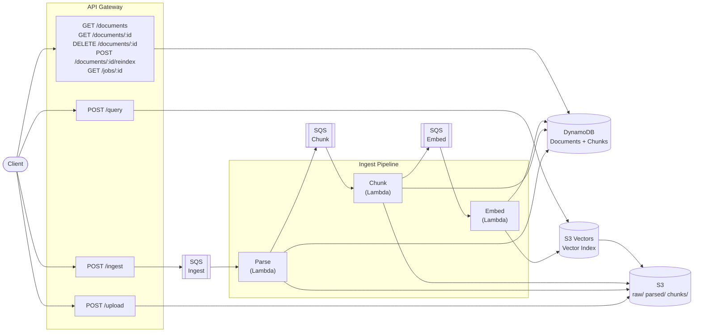

# cheapkb

A cost-effective, serverless knowledge base built on AWS. Ingest documents, chunk them intelligently, generate embeddings, and perform vector search with metadata filtering — all within the AWS Free Tier.

## Why?

AWS Managed Knowledge Base is expensive for personal or small-team use. **cheapkb** uses the same primitives (S3 Vectors, Lambda, SQS, DynamoDB) but assembles them manually at a fraction of the cost.

## Architecture



## Stack

- **Runtime:** Node.js 22.x (no Docker)
- **API:** AWS API Gateway HTTP API (v2)
- **Compute:** AWS Lambda
- **Queue:** Amazon SQS with dead-letter queues
- **Storage:** Amazon S3 (raw files, parsed text, chunks)
- **Database:** Amazon DynamoDB (document + chunk metadata)
- **Vectors:** Amazon S3 Vectors (cosine similarity search)
- **IaC:** [SST](https://sst.dev) v3 (Pulumi under the hood)

## API Reference

All endpoints are served through a single API Gateway. The base URL is printed after deployment.

### Upload

```bash
POST /upload
Content-Type: application/json

{
  "filename": "paper.pdf",
  "mimeType": "application/pdf",
  "title": "Optional title",
  "tags": ["research", "ai"],
  "authors": ["Author Name"],
  "year": 2024
}
```

**Response:**

```json
{
  "documentId": "doc_abc123",
  "uploadUrl": "https://s3...presigned-url",
  "sourceKey": "raw/doc_abc123/paper.pdf"
}
```

Upload your file to `uploadUrl` using a PUT request. The `sourceKey` is stored in DynamoDB for tracking.

### Ingest

```bash
POST /ingest
Content-Type: application/json

{
  "documentId": "doc_abc123"
}
```

Triggers the full pipeline: Parse → Chunk → Embed. Document status changes: `UPLOADED` → `QUEUED` → `PARSED` → `CHUNKED` → `EMBEDDED`.

### Query

```bash
POST /query
Content-Type: application/json

{
  "query": "What is retrieval-augmented generation?",
  "topK": 10,
  "filters": {
    "year": { "$gte": 2023 },
    "tags": "research"
  }
}
```

**Response:**

```json
{
  "query": "What is retrieval-augmented generation?",
  "topK": 10,
  "resultCount": 3,
  "results": [
    {
      "documentId": "doc_abc123",
      "chunkId": "chunk_xyz",
      "score": 0.89,
      "title": "RAG Paper",
      "pageStart": 1,
      "pageEnd": 3,
      "text": "Retrieval-augmented generation (RAG) is a technique...",
      "source": {
        "bucket": "cheapkb-storage-...",
        "key": "raw/doc_abc123/"
      }
    }
  ]
}
```

**Filters:** Supports `$eq`, `$gte`, `$lte`, `$in` operators on metadata fields.

### Documents

| Method | Endpoint | Description |
| --- | --- | --- |
| `GET` | `/documents` | List all documents |
| `GET` | `/documents/:id` | Get document details + chunks |
| `POST` | `/documents/:id/reindex` | Re-run ingest pipeline |
| `DELETE` | `/documents/:id` | Delete document, chunks, and vectors |

### Jobs

| Method | Endpoint | Description |
| --- | --- | --- |
| `GET` | `/jobs/:id` | Check ingest job status |

## Environment Variables

| Variable | Required | Description |
| --- | --- | --- |
| `EMBEDDING_PROVIDER_URL` | Yes | OpenAI-compatible embedding endpoint |
| `EMBEDDING_API_KEY` | Yes | API key for the embedding provider |
| `EMBEDDING_MODEL` | Yes | Model name (e.g., `text-embedding-3-small`) |
| `CHUNK_MAX_TOKENS` | No | Max tokens per chunk (default: `700`) |
| `CHUNK_OVERLAP_TOKENS` | No | Overlap between chunks (default: `100`) |
| `VECTOR_BATCH` | No | Vectors per batch write (default: `100`) |
| `EMBED_BATCH` | No | Embeddings per API call (default: `25`) |

## Setup

```bash
# Install dependencies
npm install

# Configure environment
cp .env.example .env
# Edit .env with your embedding provider details
```

## Deploy

```bash
# Deploy to dev
npx sst deploy --stage dev

# Deploy to production
npx sst deploy --stage production

# Remove dev deployment
npx sst remove --stage dev
```

After deployment, SST outputs the API Gateway URL:

```text
Api: https://xxxx.execute-api.us-east-1.amazonaws.com
```

## Resource Naming

All AWS resources follow the pattern:

```text
<project>-<stage>-<service>-<account_id>-<region>
```

Production stage omits the `<stage>` prefix:

```text
cheapkb-storage-REDACTED_ACCOUNT_ID-us-east-1
cheapkb-vecs-REDACTED_ACCOUNT_ID-us-east-1
```

## Cost

Designed to stay within AWS Free Tier:

- **Lambda:** 1M free requests/month
- **DynamoDB:** 25 GB storage, 25 RCU/WCU on-demand
- **S3:** 5 GB storage, 20K GET, 2K PUT requests
- **S3 Vectors:** New service, pricing TBD
- **SQS:** 1M free requests/month
- **API Gateway:** 1M free requests/month

## License

MIT
