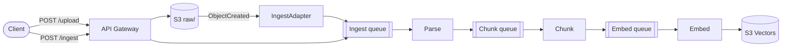

# cheapkb

[](LICENSE)
[](https://sst.dev)
[](https://www.typescriptlang.org/)
[](https://nodejs.org/)

Cost-effective serverless knowledge base on AWS. Ingest documents, chunk, embed, and search vectors within the AWS Free Tier.

## Stack

Node.js 22.x, TypeScript, [SST v4](https://sst.dev), API Gateway, Lambda, S3, S3 Vectors, DynamoDB, and SQS. A React + Vite + shadcn/ui frontend is served from S3 through CloudFront. Auth uses [shoo.dev](https://shoo.dev) PKCE with server-side JWT verification via [jose](https://github.com/panva/jose); documents are scoped per user in a DynamoDB single-table design.

## Architecture



Documents flow through an SQS-backed pipeline (parse → chunk → embed → S3 Vectors), with each stage retried independently and failures routed to a dead-letter queue. See [docs/ARCHITECTURE.md](docs/ARCHITECTURE.md) for the full data flow, DynamoDB schema, cleanup, and replacement-upload behavior.

## Quickstart

Prerequisites: Node.js 22.x, AWS credentials, and an OpenAI-compatible embeddings endpoint.

```bash
npm ci --legacy-peer-deps
npm --prefix web ci --legacy-peer-deps
cp .env.example .env          # set your embedding endpoint and key
npx sst dev                   # run the backend locally
```

Serve the frontend against a deployed or local API:

```bash
cd web
API_URL=https://<your-api-url>/v1 npm run dev   # http://localhost:5173
```

## Configuration

All environment variables are documented in [.env.example](.env.example). `sst.config.ts` loads them from `.env`. Set `AWS_ACCOUNT_ID` to pin deploys to a single account; leave it unset to deploy to whatever your credentials resolve to. See [docs/DEPLOY.md](docs/DEPLOY.md).

## API

Base URL: `https://<api-id>.execute-api.<region>.amazonaws.com/v1`. All endpoints require an `Authorization: Bearer <shoo_id_token>` header.

| Method | Path                     | Description                | Rate Limit |
| ------ | ------------------------ | -------------------------- | ---------- |
| POST   | `/upload`                | Presigned URL + doc record | 50/hr      |
| POST   | `/ingest`                | Manually trigger pipeline  | -          |
| POST   | `/query`                 | Vector search with filters | 100/hr     |
| GET    | `/documents`             | List your documents        | -          |
| GET    | `/documents/:id`         | Document + chunk details   | -          |
| PATCH  | `/documents/:id`         | Update tags                | -          |
| POST   | `/documents/:id/reindex` | Restart from failed step   | -          |
| DELETE | `/documents/:id`         | Full cleanup               | -          |
| GET    | `/tags`                  | List your tags             | -          |
| POST   | `/tags`                  | Create a tag               | -          |
| PATCH  | `/tags/:name`            | Recolor a tag              | -          |
| DELETE | `/tags/:name`            | Delete a tag               | -          |
| GET    | `/plans`                 | List billing plans         | -          |
| POST   | `/plans`                 | Create a billing plan      | -          |
| GET    | `/plans/:id`             | Get a billing plan         | -          |
| PATCH  | `/plans/:id`             | Update a billing plan      | -          |
| DELETE | `/plans/:id`             | Delete a billing plan      | -          |
| GET    | `/account`               | Account profile and plan   | -          |
| GET    | `/account/usage`         | Current cycle usage        | -          |
| GET    | `/account/plans`         | Plans available to account | -          |
| PATCH  | `/account/plan`          | Assign a plan              | -          |

Full request/response schemas: [docs/openapi.yaml](docs/openapi.yaml).

## Test

```bash
npm ci --legacy-peer-deps
npm --prefix web ci --legacy-peer-deps
npm run format:check && npm run build && npm test
API_URL=https://example.execute-api.us-east-1.amazonaws.com/v1 npm --prefix web run build
```

## Deploy

```bash
npx sst deploy --stage production
```

CI deploys automatically on merge to `main` via `.github/workflows/deploy.yml`. See [docs/DEPLOY.md](docs/DEPLOY.md).

## Documentation

- [Architecture](docs/ARCHITECTURE.md) — data flow, DynamoDB schema, cleanup, replacement uploads
- [Frontend](docs/FRONTEND.md) — web workspace, auth flow, uploads
- [Billing and usage](docs/BILLING.md) — plans, usage cycles, storage accounting
- [API reference](docs/openapi.yaml) — OpenAPI 3 spec

## Contributing

See [CONTRIBUTING.md](CONTRIBUTING.md).

## License

[MIT](LICENSE)
