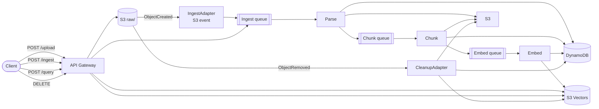

# Architecture

## Data Flow



## Pipeline Stages

| Stage  | Lambda (memory) | Timeout | Output                    |
| ------ | --------------- | ------- | ------------------------- |
| Parse  | 1024 MB         | 300 s   | `parsed/{id}/v1/pages.json` |
| Chunk  | 1024 MB         | 300 s   | `chunks/{id}/*.json`        |
| Embed  | 1024 MB         | 300 s   | S3 Vectors                  |

Each stage writes to DynamoDB before queueing the next stage. On error, `lastError` is set and the message is re-queued up to 3 times via SQS. After 3 failures the document is marked `FAILED` with `failedStep` set to the failing stage.

## DynamoDB Schema

Single table `Meta`. Primary key: `pk` (string) / `sk` (string). GSI1 on `gsi1pk` / `gsi1sk` for status-based queries.

| Key                  | Type   | Purpose                          |
| -------------------- | ------ | -------------------------------- |
| `pk`                 | string | `DOC#{documentId}`               |
| `sk`                 | string | `META`                           |
| `gsi1pk`             | string | `STATUS#{status}`                |
| `gsi1sk`             | string | ISO timestamp                    |

Document attributes: `documentId`, `title`, `status`, `sourceKey`, `mimeType`, `lastError`, `retryCount`, `failedStep`, `chunkCount`, `embeddedCount`, `tags`, `authors`, `year`, `createdAt`, `updatedAt`.

## S3 Layout

```
raw/{documentId}/{filename}        # Original upload
parsed/{documentId}/v1/pages.json  # Extracted text
chunks/{documentId}/chunk_*.json   # One JSON per chunk
```

## Batch + Parallelism

- `Chunk` writes all chunk JSONs in parallel, then sends chunks to the embed queue in groups of 10.
- `Embed` reads chunks in batches of `EMBED_BATCH` (default 25), embeds them in one request, and writes vectors in batches of `VECTOR_BATCH` (default 100).
- `Query` fetches all matched chunk JSONs in parallel.

## Error Handling

- Auto-retry: failures increment `retryCount`; below 3 the document is re-queued automatically.
- After 3 failures: `status = FAILED`, `failedStep` set, `lastError` populated.
- `POST /documents/:id/reindex` resumes from the appropriate stage and resets `lastError`/`retryCount`/`failedStep`.

## Auto Cleanup

Triggered by `DELETE /documents/:id` (API) or by S3 `ObjectRemoved:Delete` / `ObjectRemoved:DeleteMarkerCreated` events for keys under `raw/`. The cleanup function:

1. Lists and deletes all S3 Vectors for the document.
2. Deletes all `chunks/{id}/` and `parsed/{id}/` S3 objects.
3. Deletes the source file in `raw/{id}/`.
4. Deletes the DynamoDB `META` record.

## Resource Naming

`<project>-<stage>-<service>-<account-id>-<region>`. Production omits the stage prefix.
