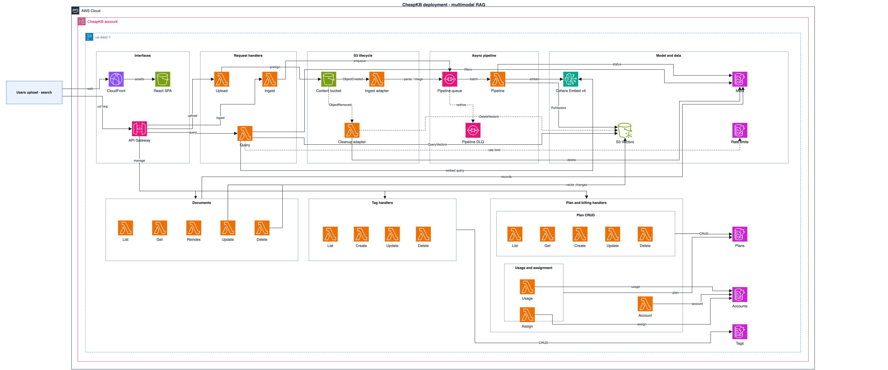

# How CheapKB works

## Main components

| Component                   | Purpose                                                                                                                                                  |
| --------------------------- | -------------------------------------------------------------------------------------------------------------------------------------------------------- |
| Web app                     | Lets users sign in, upload content, manage documents and metadata, review usage, and run searches.                                                       |
| API                         | Authenticates requests and routes each action to the appropriate handler.                                                                                |
| Upload and ingest handlers  | Create the document record, provide a temporary direct-upload form, and start processing after S3 accepts the file.                                      |
| Content bucket              | Keeps the original uploads and the intermediate content needed while documents are processed.                                                            |
| Ingest and cleanup adapters | React to S3 changes. New objects enter the processing pipeline; deleted objects have their related search data removed.                                  |
| Pipeline queue              | Buffers processing work so uploads do not wait for parsing and embedding. Failed work is retried, then moved to the dead-letter queue for investigation. |
| Pipeline                    | Validates the file, extracts document content, divides text into searchable sections, and prepares text or images for embedding.                         |
| Amazon Bedrock              | Runs Cohere Embed v4 to create compatible vectors for document text, images, and search queries.                                                         |
| S3 Vectors                  | Stores embeddings and performs similarity search.                                                                                                        |
| Metadata store              | Tracks ownership, document metadata, processing status, errors, and the relationship between documents and vectors.                                      |
| Document and tag handlers   | List, retrieve, edit, retry, replace, and delete documents and their tags.                                                                               |
| Plan and usage handlers     | Apply the deployment-owned default plan and return the signed-in account's allowance, storage, and processing usage.                                     |

## Upload flow

1. The web app asks the API to create an upload. CheapKB checks authentication, the account allowance, file type, size, and duplicates.
2. The upload handler returns a short-lived form that lets the browser send the file directly to the content bucket.
3. After S3 accepts the object, the ingest adapter confirms the upload, records its size, and places it on the pipeline queue.
4. The pipeline parses documents or validates images, prepares searchable items, and asks Cohere Embed v4 for embeddings.
5. The vectors are written to S3 Vectors and the document status changes to completed. The web app can show progress or a retryable failure throughout the flow.

CheapKB accepts PDF, Markdown, text, JPEG, PNG, WebP, and GIF files. Image files can be up to 5 MB; the configured upload limit applies to documents. Duplicate active uploads are rejected for the same user, while completed or failed content can be replaced.

## Search flow

1. The user submits text, one supported image up to 5 MB, or both, with optional metadata filters.
2. The query handler asks Cohere Embed v4 to create one search embedding. A combined query uses its text and image together.
3. S3 Vectors finds the closest vectors while CheapKB applies the signed-in user's ownership and selected metadata filters.
4. CheapKB loads the matching source information and returns ranked results to the web app.

Documents and images use the same search experience. Content indexed with different embedding models is kept separate because vectors from different models are not compatible.

## Updates, replacement, and deletion

Editing a processed document updates its searchable tags without uploading the file again. Names, authors, and other metadata are set during upload.

Replacing a completed or failed document keeps the existing version searchable until S3 accepts the replacement. CheapKB then removes the old derived content and vectors before processing the new version.

Deleting a document removes its uploaded content, intermediate content, metadata, and vectors. An S3 deletion event uses the same cleanup behavior so search results do not point to removed content.

## Reliability and cost controls

Processing happens asynchronously so upload requests remain short. Failed records are retried without replaying successful records; a failed embedding batch is split to isolate its failing input. Repeated failures move to the dead-letter queue and appear as failed documents that users can retry.

CheapKB shares pipeline resources and batches available embedding work to avoid unnecessary idle infrastructure and requests. File, image, chunk, and account allowance limits bound unexpected processing cost.
