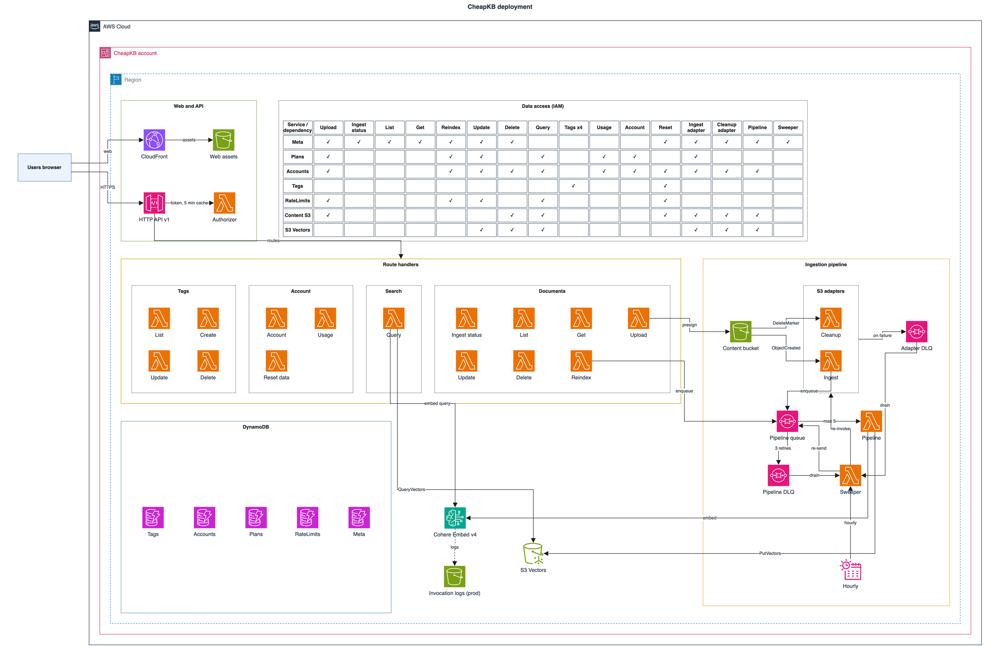

# How CheapKB works

## Main components

| Component                   | Purpose                                                                                                                                        |
| --------------------------- | ---------------------------------------------------------------------------------------------------------------------------------------------- |
| Web app                     | Lets users sign in, upload content, manage documents and metadata, review usage, and run searches.                                             |
| API                         | Authenticates requests and routes each action to the appropriate handler. The stage is throttled to 50 requests per second with bursts of 100. |
| Upload and ingest handlers  | Create the document record, provide a temporary direct-upload form, and start processing after S3 accepts the file.                            |
| Content bucket              | Keeps the original uploads and the intermediate content needed while documents are processed.                                                  |
| Ingest and cleanup adapters | React to S3 changes. New objects enter the processing pipeline; deleted objects have their search data removed unless re-uploaded.             |
| Pipeline queue              | Buffers processing work so uploads do not wait for parsing and embedding. Failed work is retried, then moved to the dead-letter queue.         |
| Sweeper                     | Runs hourly. Gives dead-lettered pipeline work and failed S3 adapter events one more try, then marks the document failed.                      |
| Pipeline                    | Validates the file, extracts document content, divides text into searchable sections, and prepares text or images for embedding.               |
| Amazon Bedrock              | Runs Cohere Embed v4 to create compatible vectors for document text, images, and search queries.                                               |
| S3 Vectors                  | Stores embeddings and performs similarity search.                                                                                              |
| Metadata store              | Tracks ownership, document metadata, processing status, errors, and the relationship between documents and vectors.                            |
| Document and tag handlers   | List, retrieve, edit, retry, replace, and delete documents and their tags.                                                                     |
| Plan and usage handlers     | Apply the deployment-owned default plan and return the signed-in account's allowance, storage, and processing usage.                           |

## Upload flow

1. The web app asks the API to create an upload. CheapKB checks authentication, the account allowance, file type, size, and duplicates.
2. The upload handler returns a short-lived form that lets the browser send the file directly to the content bucket.
3. After S3 accepts the object, the ingest adapter confirms the upload, records its size, and places it on the pipeline queue.
4. The pipeline parses documents or validates images, prepares searchable items, and asks Cohere Embed v4 for embeddings.
5. The vectors are written to S3 Vectors and the document status changes to completed. The web app can show progress or a retryable failure throughout the flow.

CheapKB accepts PDF, Markdown, text, JPEG, PNG, WebP, and GIF files. Image files can be up to 5 MB; the configured upload limit applies to documents. Duplicate active uploads are rejected for the same user, while completed or failed content can be replaced.

## Search flow

1. The user submits text, one supported image up to 5 MB, or both, with optional metadata filters.
2. The query handler asks Cohere Embed v4 to create one search embedding. A combined query uses its text and image together.
3. S3 Vectors finds the closest vectors while CheapKB applies the signed-in user's ownership and selected metadata filters.
4. Each vector stores its chunk's full text, up to 32 KB, so CheapKB returns ranked results without reading the content bucket. Vectors written before this keep 500 characters and are completed from their stored chunk file.

Documents and images use the same search experience. Content indexed with different embedding models is kept separate because vectors from different models are not compatible.

## Updates, replacement, and deletion

Editing a completed or failed document updates its searchable tags without uploading the file again. Names, authors, and other metadata are set during upload. An edit cannot start while a replacement upload is pending. A document cannot be deleted while an edit is still writing to it. If an account reset or an S3 removal deletes it anyway, the edit removes the vectors it rewrote. Tags live only in the document record and the vectors, so an edit makes no S3 requests.

Uploading a file with the same name and type replaces the existing document. Names keep their Unicode letters and digits, so differently named non-English files stay separate documents. A non-English file uploaded before this rule is not matched on re-upload and becomes a new document, since its original name was not stored. Replacing a completed or failed document keeps the existing version searchable until S3 accepts the replacement. CheapKB then removes the old derived content and vectors before processing the new version. Tag edits and reindex wait while a replacement is pending and for a 15-minute grace after its upload window, so nothing races it. A replacement still being processed after that grace is rolled back to the previous file and the document records why.

Deleting a document removes its uploaded content, intermediate content, metadata, and vectors. An S3 deletion event uses the same cleanup behavior so search results do not point to removed content. Deletion first marks the document as deleting. Pipeline work still in flight then stops, and embedding removes any vector it wrote after that point, so deleted content cannot reappear in search.

## Reliability and cost controls

Processing happens asynchronously so upload requests remain short. Failed records are retried without replaying successful records; a failed embedding batch is split to isolate its failing input. Content that can never succeed, such as a PDF over 2,000 pages or a file with no text, fails on the first attempt. Repeated failures move to the dead-letter queue, and the hourly sweeper retries them once before marking the document failed so users can retry it. The chunk stage writes no per-chunk files: each embed message carries its chunk's text, and the embed stage reads title, tags and source from the document record once per batch, so the S3 request free tier is not spent per chunk. Reindexing a document that was parsed chunks its stored text again and re-embeds every chunk; when the new chunking yields fewer chunks, the extra rows and vectors are removed. A redelivered chunk message keeps chunks that were already embedded since the last reindex, so they are not embedded or charged twice. When two deliveries of one chunk run at once, the first claims it for five minutes and the other is dropped, so Bedrock is called once.

CheapKB shares pipeline resources and batches available embedding work to avoid unnecessary idle infrastructure and requests. The pipeline runs at most 5 concurrent Lambdas, so one busy account cannot use up the shared Bedrock quota. File, image, chunk, and account allowance limits bound unexpected processing cost. Each account holds at most 1,000 documents with 10 processing at once; the document list marks which ones count (`inFlight`), the upload refusal carries the `PROCESSING_LIMIT` code, and a bulk sync in the web app waits for room instead of failing. Issuing an upload form records a small upload charge; only the S3 upload event queues a new document and charges its ingest and storage, and it checks the allowance again, so a burst of upload forms cannot outspend it. A refused replacement is rolled back to the previous file, and a refused new upload is marked failed and its bytes still count toward storage. An upload that lands while or after its document is deleted is removed, and an overwrite through an old upload form is charged. Reindex and tag edits are rate limited and check the allowance, and reindex refuses documents that are still processing. Bedrock invocation logs keep request metadata and token counts, not document text or images.
